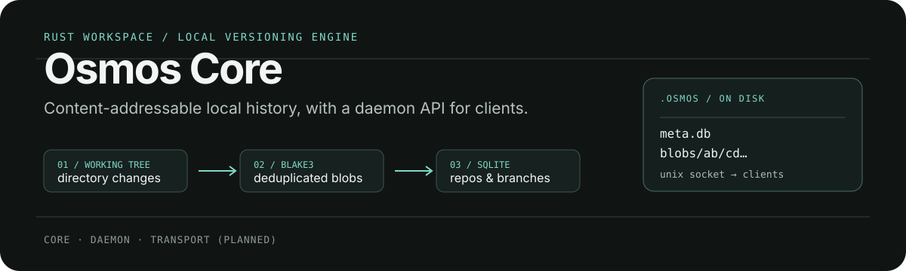

<p align="center">
  
</p>

# Osmos Core

[🇬🇧 English](README.md) · [🇹🇷 Türkçe](README.tr.md)

`osmos-core`, Osmos'un arkasındaki Rust motorudur. Bir dizinin yerel geçmişini içerik-adresli (content-addressable) depolamada kaydeder, repository meta verilerini SQLite'ta tutar ve istemci uygulamalar için bir Unix domain socket daemon üzerinden sunar.

> Durum: Yerel versiyonlama ve daemon API'si tamamlanmıştır. Eş keşfi (peer discovery) ve QUIC transport katmanı planlanan geliştirmelerdir.

## Neler Bulunuyor

| Crate | Görev |
| --- | --- |
| [`osmos-core`](crates/osmos-core) | Değişiklikleri algılar; BLAKE3 adresli blob'ları depolar; SQLite içinde repository, commit ve branch yönetimini sağlar. |
| [`osmos-daemon`](crates/osmos-daemon) | `/tmp/osmos-daemon.sock` üzerinden satır sonu ile ayrılmış (newline-delimited) JSON kabul eder ve komutları motora iletir. |
| [`osmos-transport`](crates/osmos-transport) | Gelecekteki mDNS + QUIC transport katmanı için ayrılmıştır. |

## Nasıl Çalışır

```text
working directory → BLAKE3 adresli blob'lar + SQLite meta verisi → daemon → yerel istemciler
```

Başlatılmış (initialized) bir repository bir `.osmos/` dizini alır:

```text
<repo_root>/.osmos/
├── meta.db       # repositories, commits, tree entries, branches
└── blobs/
    └── ab/cd…    # BLAKE3 adresli dosya içeriği
```

## Başlarken

Rust 1.75 veya daha yeni bir sürüm gerektirir.

```bash
cargo build --release
cargo test
```

Yerel daemon'ı çalıştırın:

```bash
cargo run --bin osmos-daemon
```

`/tmp/osmos-daemon.sock` adresinden dinleme yapar.

## Daemon Protokolü

İstekler ve yanıtlar satır sonu ile ayrılmış JSON'dur (NDJSON). Örneğin, bir repository başlatmak için:

```json
{"id":"e43b1747-8cfb-4a5d-b2a8-12cd3111b7df","cmd":{"type":"init_repo","path":"/absolute/path/to/project","name":"My Project","mode":"client"}}
```

Desteklenen komutlar arasında `ping`, repository başlatma ve durum (`status`), commit'ler ve branch işlemleri (`create`, `list`, `switch`, `merge` ve `delete`) yer alır. Protokol tipleri için [`crates/osmos-core/src/lib.rs`](crates/osmos-core/src/lib.rs) dosyasına bakabilirsiniz.

## Yol Haritası (Roadmap)

- [x] Yerel versiyonlama, BLAKE3 blob depolama, SQLite meta verisi ve socket API.
- [ ] `osmos-transport` üzerinden eş keşfi (peer discovery) ve senkronizasyon.

## Lisans

MIT — detaylar için [LICENSE](LICENSE) dosyasına bakabilirsiniz.
